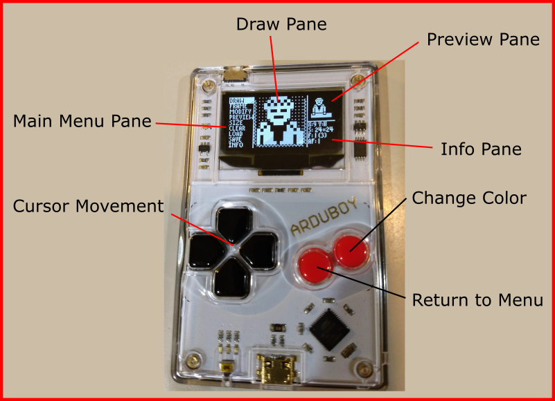
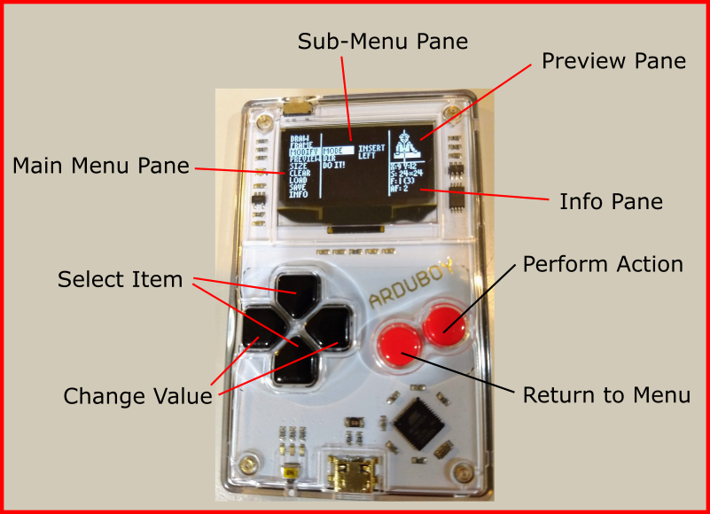

# ASE - Arduboy Sprite Editor

## Overview
ASE - a sprite editor for Arduboy games that runs on the Arduboy.

_Example of Drawing Screen:_




_Example of Sub-Menu Screen:_




## Layout
- The screen is divided into 4 parts:

  - **Main Menu Pane**: on the left
    - Select the *Draw*, *Frame*, *Modify*, *Preview*, *Size*, *Clear*, *Load*, *Store* or *Info* menu items.
  - **Draw / Sub-Menu Pane**: in the middle
    - *Draw* is the main drawing area and where most of the sprite design time is spent.
    - *Sub-Menu* is shown when a non-draw menu item is selected.
  - **Preview Pane**: in the upper right
    - Shows the sprite in the actual scale.
      - Can optionally change the background and whether the sprite is animate and/or tiled.
  - **Info Pane**: in the lower right
    - Show the following information:
        - The current X and Y coordinates of the cursor within the sprite.
        - Size of the sprite, given as "width * height".
        - Current and total frames given as "current (total)".
        - Animated frame (AF) being displayed.  If animation is turned off, will be the same as the current Frame.

## Usage

- **Main Menu Mode**:
The application starts out in the *Main Menu Mode*, where the UP and DOWN buttons will move the cursor to choose a menu item and the B button will select then item. If the DRAW menu item is selected, then the application will be in *Draw Mode*, if another main menu item is selected then the application will be in *Sub Menu Mode*.
- **Draw Mode**:
  - In *Draw Mode*, the UP, DOWN, RIGHT, and LEFT button will move the cursor, the A button will return to *Main Menu Mode*, and the B button will alter the color of the pixel under the cursor.  
  - The pixel can be in one of 3 colors: Transparent, White or Black.  Pressing the B button will cycle through the 3 colors.  If the B button is held down, the last color set will continue to set any other pixel the cursor is moved to.  This is an easy way to color a block of pixels the same. 
  - If a directional button is held down, after a short delay the cursor will repeatedly move.
  - The cursor will wrap around if going past the edge of the sprite.
  - The *Draw Pane* contains 16 x 16 pixels.  If the sprite is smaller than 16 in a dimension, gray boxes will fill in the unused area. If the sprite is larger than 16 in a dimension, moving the cursor off the pane will scroll the pixels. A squiggle line on the edge is used to show the direction in which there are more pixels.
- **Sub Menu Mode**: In *Sub Menu Mode*, the UP and DOWN buttons will move the cursor to choose an item. The A button will return to the *Main Menu Mode*. For items with a value, the LEFT and RIGHT button will change the value. Certain items will perform an action when the B button is pressed.
  - **Frame**: 
    - **Current**: lets you pick the current frame to edit.
    - **Copy To**: when activated by pressing the B button will copy the current frame to the *Copy To* frame.  Be careful as this will overwrite any previous drawing on the *Copy To* frame.
    - **Swap With**: when activated by pressing the B button will switch the current frame and the *Swap With* frame.
    - **Total**: sets the total number of frames up to a limit imposed by the buffer size.  Note that if the total frames is reduced, the upper frames still exist in the buffer and can be re-accessed by increasing the total.  The total can be set to tune the number of frames in an animation and to be saved.
  - **Modify**: the *Modify* sub menu lets you change the current frame of the sprite based on the cursor position and a set direction. The cursor position is set in the *Draw Mode*. The cursor position is shown in the *Preview Pane* as a horizontal line if the direction is up or down and as a vertical line if the direction is left or right.
    - **Mode**:
      - **Flip**: if the direction is up or down, will flip the frame vertically.  If the direction is right or left, will flip the frame horizontally.
      - **Insert**: Inserts a copy of the pixels on the cursor line show in the *Preview Pane* and moves the existing lines in the set direction from the cursor.  This can be used to shift a sprite position if the cursor is outside of the image, or to grow a sprite in one dimension if the cursor is inside the image.
      - **Delete**: Deletes the pixels on the cursor line show in the *Preview Pane* and moves the existing lines in the set direction from the cursor, filling in a line of transparent pixels on the outer edge.  This can be used to shift a sprite position or shrink a sprite in one dimension.
    - **Direction**: pick a direction for the modification: up, down, right, or left.
    - **Do It!**: This selection will perform the selected action when the B button is pressed.
  - **Preview**:
    - **BG**: Background setting.  Choose the background for the *Preview Pane* which is a good way to test the transparency of a sprite.  Choices are black, white or checker (alternating black/white pixels in a checkerboard pattern).
    - **Tile**: Chooses if the *Preview Pane* should just show one copy of the sprite or tile as many copies as will fit.  Can be used to make sure the edges of the sprite lines up when used in a tiling pattern.
    - **Anim.**: Set the sprite animation setting.
      - 0 = only show the current frame
      - 1 or more = increment through all the frames based on the *Total Frames* setting in the *Frame* sub-menu. A larger value will increase the animation speed.
  - **Size**: 
    - **Width**: Sets the width of the sprite in pixels.  Can range in value from 1 to 32.
    - **Height**: Sets the height of the sprite in pixels.  Can range in value from 1 to 32.  Values not divisible by 8 may not produce good results depending on the library being used to draw the sprite.
    - Note that changing the size does not clear the buffer, which can produce interesting results. It is recommended to clear all frames after changing the size, but it isn't necessary.
  - **Clear**:
    - **This Frame**: When activated by pressing the B button will set all the pixels in the current frame to transparent.
    - **All Frames**: When activated by pressing the B button will set all the pixels in all frames to transparent.  The number of frames is based on the *Total Frames* setting in the *Frame* sub-menu.
  - **Load**: Either loads an example or load a design over USB using a serial interface.  The parser for the serial interface is pretty dumb, so can only handle decimal integers separated by commas.  No other text should be included.
    - **With Mask**: when selected with the B button will read a design that specifies both the pixel on/off data and the transparency mask data.  Should be used when a design was saved with *With Mask*.
    - **No Mask**: when selected with the B button will read a design that specifies just pixel on/off data.  Should be used when a design was saved with *No Mask*. In this mode, all pixels will either be white or transparent.
    - **Example**: loads a built in example image that can be animated.
  - **Save**: Saves a design over USB using a serial interface.  The design can be used directly in a Arduboy game or can be loaded back into the editor. Each frame will start a new output line. It is suggested that you save often when designing a sprite so you have a backup copy in case of future mistakes.
    - **With Mask**: when selected with the B button will write a design that specifies both the pixel on/off data and the transparency mask data.
    - **No Mask**: when selected with the B button will write a design that specifies just pixel on/off data.
  - **Info**: Shows some information about the application.  The A button will return to the Main Menu.
 
## Notes

- *Loading* and *Saving* can do done using the Arduino serial monitor when the Arduboy is connected to a PC using a USB cable.  To bring up the serial monitor, launch the Arduino platform and click on the microscope looking icon in the upper right corner. Saving the design will output the results in the serial monitor.  This can be cut and pasted directly into code, like the *Code Example* below.  To load a design, select the text between the *BEGIN* and *END* comments (don't include the lines with *BEGIN* or *END*) and paste it into the serial monitor input line and click send.  Then select load on the *Arduboy Sprite Editor*.

## Code Example

Here is a complete code example using a saved sprite:

```c++
const unsigned char PROGMEM sprite_and_mask[] = {
// For load, cut and paste between START and END, and send over serial port
// then choose LOAD WITH MASK
// START
16,16,
120,248,140,252,228,252,246,254,162,254,91,255,169,255,21,255,13,255,21,255,173,255,89,255,170,254,242,254,68,252,24,248,3,3,6,7,5,7,13,15,10,15,27,31,22,31,21,31,22,31,21,31,22,31,23,31,26,31,13,15,6,7,3,3,
120,248,188,252,220,252,238,254,174,254,87,255,167,255,23,255,7,255,23,255,167,255,87,255,174,254,238,254,92,252,24,248,3,3,6,7,5,7,13,15,10,15,27,31,22,31,21,31,22,31,21,31,22,31,23,31,26,31,13,15,6,7,3,3,
248,248,252,252,124,252,126,254,190,254,63,255,191,255,63,255,63,255,63,255,191,255,63,255,190,254,190,190,60,188,248,248,3,3,6,7,5,7,13,15,10,15,27,31,22,31,21,31,22,31,21,31,22,31,23,31,26,31,13,15,6,7,3,3,
248,248,252,252,252,252,254,254,254,254,255,255,255,255,255,255,255,255,255,255,255,255,255,255,254,254,254,254,252,252,120,248,2,3,6,7,5,7,13,15,11,15,27,31,23,31,23,31,23,31,23,31,23,31,23,31,27,31,13,15,6,7,3,3
// END
};

#include <Arduboy2.h>
#include <Sprites.h>
Arduboy2 arduboy;
Sprites  sprites;
uint8_t sequence = 100;

void setup() {
  arduboy.begin();
  arduboy.setFrameRate(30);
}

void loop() {
  if (!(arduboy.nextFrame())) return;
  arduboy.fillScreen(WHITE);
  uint8_t frame = sequence < 4 ? sequence : sequence < 7 ? 7 - sequence : 0;
  if (sequence-- == 0) sequence = random(10,100);
  sprites.drawPlusMask((WIDTH-16)/2-12,(HEIGHT-16)/2,sprite_and_mask,frame);
  sprites.drawPlusMask((WIDTH-16)/2+12,(HEIGHT-16)/2,sprite_and_mask,frame);
  arduboy.display();
}
```
